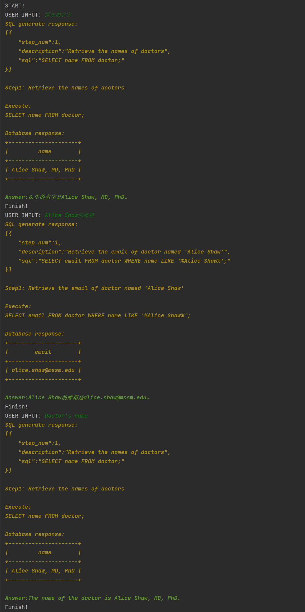

# ChatDB Magic: Augmenting LLMs with Databases as Their Symbolic Memory 
## Refining ChatDB with SQLite database support and improved convenience

Forked from https://github.com/huchenxucs/ChatDB

# Modifications:
- Added support for SQLite and MySQL.
- Default database transitioned to SQLite; you can switch back to MySQL by modifying the .env file.
    > DB_TYPE=sqlite or DB_TYPE=mysql
- Implemented Answer Analysis, utilizing ChatGPT to analyze SQL results.
    > Optional, set use_semantic_answer=False in chatdb.py to disable it.
    ```shell
    USER INPUT: Doctor's name
  
    Database response:
    +---------------------+
    |         name        |
    +---------------------+
    | Alice Shaw, MD, PhD |
    +---------------------+
    
    Answer: The name of the doctor is Alice Shaw, MD, PhD.
  ```
- Introduced automatic language translation for Answer Analysis.
- Revised prompt template to JSON format and integrated colored text into console chat.
- Added support for the gpt-3.5-turbo-16k model, set FAST_LLM_MODEL=gpt-3.5-turbo-16k in .env file.
- Included configuration for adding synonyms for table fields in the Prompt, set synonyms in chatdb_prompts.py file.


# Run and Use:
- Follow the instructions in the [README](README_raw.md).
- Quick demo:
  ```shell
      copy .env.template .env     # Set your OpenAI key and host, if use mysql, need to set host, port, name, password.
      pip install -r requirements.txt
      python chatdb.py
  
      START!
      USER INPUT: How many apples does the customer named 'Chenzhuang Du' bought on 2010-03-27
      
      Step1: Retrieve the quantity of apples bought by the customer
      SELECT si.quantity_sold
      FROM customers c
      JOIN sales s ON c.customer_id = s.customer_id
      JOIN sale_items si ON s.sale_id = si.sale_id
      JOIN fruits f ON si.fruit_id = f.fruit_id
      WHERE c.first_name = 'Chenzhuang' AND c.last_name = 'Du' AND f.fruit_name = 'apple' AND s.sale_date = '2010-03-27';
      
      Execute: 
      
      
      Database response:
      no results found.
      
      Finish!
  ```
- Use your own data:
  ```angular2html
    I fixed some bugs, it's better to follow these steps:
    1. Put your sqlite db file to replace try1024.db. 
    2. Open chatdb.py, set init_db = True to False, to disable create and insert sample data.
    3. Open table_schema.py and add your table schema and then add these variables to `tables` list at the bottom.
    4. Run chatdb.py
    5. Input your query, like the demo above.
    Also, you can change sql_examples.py to use your own examples.
  ```

- Demo
